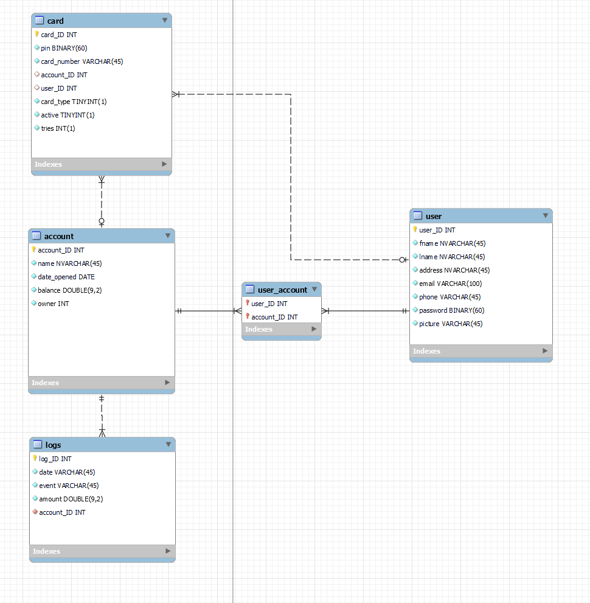

# Bank Simulation

## Installation
Run `npm ci` in /web/frontend and /web/backend

### .env
Generate a secret token
```js
> node
> require('crypto').randomBytes(64).toString('hex')
```

Fill /web/backend/.env with your database credentials and the secret token you created.

### Database
Import banksim.sql
```
mysql -u <user> root -p < banksim.sql
```

### Launch the environment
In /web/frontend/ run:
```
npm run build
```
In /web/backend/ run:
```
npm start
```

